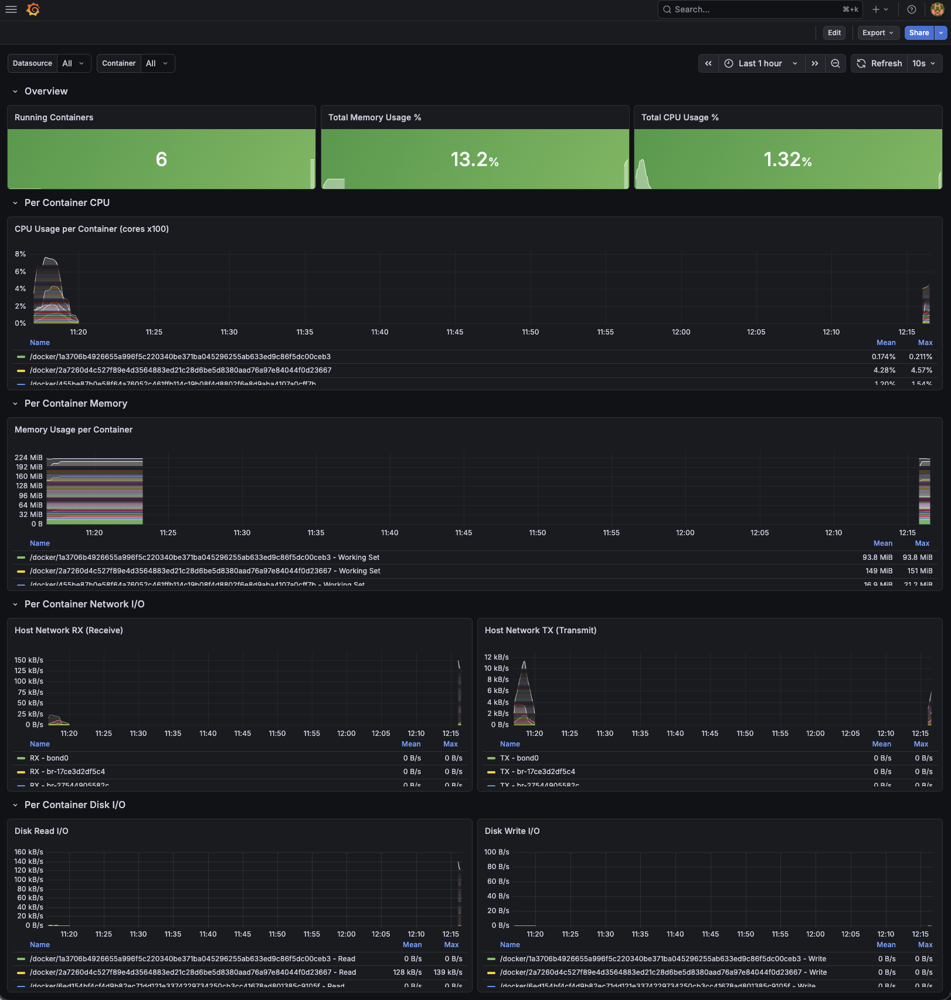

# Docker Monitoring Stack

Monitoring stack for Docker containers using Prometheus, Grafana, and cAdvisor.



## Components

| Service     | Port | Description                                     |
|-------------|------|-------------------------------------------------|
| Prometheus  | 9090 | Monitoring and alerting system                  |
| Grafana     | 3000 | Dashboard visualization                         |
| cAdvisor    | 8080 | Docker container metrics collector              |

## Prerequisites

- [Docker](https://docs.docker.com/get-docker/)
- [Docker Compose](https://docs.docker.com/compose/install/)

## Usage

Start the stack:

```bash
docker compose up -d
```

Stop the stack:

```bash
docker compose down
```

## Access

- **Grafana**: http://localhost:3000
  - Username: `admin`
  - Password: `admin`
- **Prometheus**: http://localhost:9090
- **cAdvisor**: http://localhost:8080

## Scrape Targets

| Job             | Target                     | Description                   |
|-----------------|----------------------------|-------------------------------|
| prometheus      | localhost:9090             | Prometheus own metrics        |
| cadvisor        | cadvisor:8080              | Docker container metrics      |
| docker-desktop  | host.docker.internal:9323  | Docker Desktop metrics        |

## Configuration

- `prometheus.yml` - Prometheus scrape targets
- `docker-compose.yml` - Docker Compose services
- `provisioning/datasources/prometheus.yml` - Grafana datasource
- `provisioning/dashboards/dashboards.yml` - Grafana dashboard provisioning
- `dashboards/` - Dashboard JSON files

## Data Retention

Metrics data is retained for **7 days** (`--storage.tsdb.retention.time=7d`).
